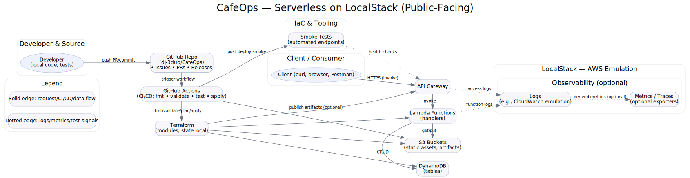

## ☕ CafeOps Architecture

  

Public-facing overview of **CafeOps** — an AWS serverless stack emulated with **LocalStack**, provisioned by **Terraform**, and validated via **GitHub Actions** and **smoke tests**.

**Flow:** Dev pushes → GitHub Actions (fmt/validate/test/apply) → Terraform → LocalStack resources (**API Gateway → Lambda → DynamoDB/S3**).  
Requests hit API Gateway → invoke Lambda → read/write **DynamoDB** and **S3**. Logs/metrics are optional and can be wired to CloudWatch emulation or exporters.

*Rendered from* [`cafeops_architecture_public.dot`](./cafeops_architecture_public.dot) *using Graphviz.*
