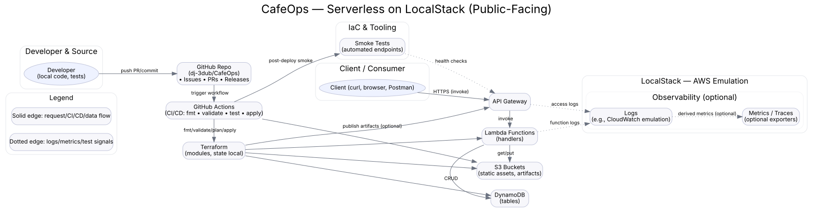

# CafeOps

**Serverless Operations Platform | Terraform | AWS Lambda | API Gateway | DynamoDB | LocalStack**

CafeOps is a serverless operations platform built to demonstrate modern cloud engineering practices using AWS services, Infrastructure as Code, and automated deployment workflows.

The platform manages inventory, stock movements, and order processing through a REST API backed by AWS Lambda, API Gateway, and DynamoDB. Infrastructure is provisioned and maintained using Terraform, while LocalStack provides a fully local development environment that mirrors core AWS services.

This project was designed to showcase practical cloud engineering skills including Infrastructure as Code, serverless application development, API design, automated provisioning, operational automation, and cloud-native architecture patterns.

---

## Architecture



### Architecture Summary

CafeOps follows a serverless architecture pattern where API Gateway routes requests to Lambda functions responsible for inventory, order, and stock movement workflows. Data is persisted in DynamoDB, while Terraform manages the complete infrastructure lifecycle. LocalStack provides a local AWS-compatible environment for development and testing.

---

## Project Highlights

* Serverless REST API built with AWS Lambda and API Gateway
* Infrastructure provisioned and managed through Terraform
* DynamoDB-backed inventory, order, and stock management workflows
* Local AWS emulation using LocalStack
* Docker Compose-based development environment
* Automated operational workflows through Makefile targets
* GitHub Actions CI/CD pipeline for Terraform validation
* Python-based Lambda functions and automation scripts

---

## Core Components

### AWS Lambda

Provides serverless business logic for:

* Inventory management
* Order processing
* Stock movement tracking

### Amazon API Gateway

Acts as the public REST API entry point and routes requests to the appropriate Lambda functions.

### Amazon DynamoDB

Provides persistent storage for:

* Items
* Orders
* Stock Movements

### Terraform

Manages infrastructure lifecycle and resource provisioning.

### LocalStack

Provides a local AWS-compatible development and testing environment.

### Docker Compose

Orchestrates LocalStack and supporting services.

### Makefile

Provides operational automation for deployment, validation, testing, and troubleshooting workflows.

---

## Functional Areas

### Inventory Management

Maintains product catalog information and inventory records.

### Stock Movement Tracking

Tracks inventory adjustments, receipts, and stock changes.

### Order Processing

Processes and records customer orders through REST API endpoints.

---

## Technology Stack

### Cloud Services

* AWS Lambda
* Amazon API Gateway
* Amazon DynamoDB

### Infrastructure & Automation

* Terraform
* Docker
* Docker Compose
* LocalStack
* Makefile
* GitHub Actions

### Development

* Python 3.11
* REST APIs
* JSON
* Shell Scripting

---

## Skills Demonstrated

* Infrastructure as Code (Terraform)
* Serverless Architecture Design
* AWS Service Integration
* API Design and Development
* Cloud Resource Provisioning
* IAM and Access Management
* DynamoDB Data Modeling
* Docker-Based Development Environments
* Operational Automation
* CI/CD Pipeline Validation
* Platform Engineering Fundamentals
* Cloud-Native Application Design

---

## Repository Structure

```text
.
├── .github/
│   └── workflows/
│       └── validate.yml
├── docs/
│   ├── ARCHITECTURE.md
│   ├── RUNBOOK.md
│   └── TERRAFORM.md
├── infra/
│   └── terraform/
│       ├── versions.tf
│       ├── providers.tf
│       ├── variables.tf
│       ├── outputs.tf
│       ├── terraform.tfvars.example
│       └── main.tf
├── scripts/
├── src/
│   ├── common/
│   └── handlers/
├── webui/
├── docker-compose.yml
├── Makefile
└── README.md
```

---

## Infrastructure as Code

Infrastructure is provisioned and managed through Terraform and includes:

### DynamoDB

* Items table
* Orders table
* StockMovements table

### IAM

* Lambda execution roles
* IAM policies
* Policy attachments

### AWS Lambda

* items
* orders
* stock

### API Gateway

* REST API
* Resource routing
* Stage deployment
* CORS configuration

Terraform configuration is organized using:

```text
infra/terraform/
├── versions.tf
├── providers.tf
├── variables.tf
├── outputs.tf
├── terraform.tfvars.example
└── main.tf
```

---

## Operations

### Start Environment

```bash
make up
```

### Stop Environment

```bash
make down
```

### View Service Status

```bash
make status
```

### View Logs

```bash
make logs
```

### Initialize Terraform

```bash
make tf-init
```

### Validate Terraform

```bash
make tf-validate
```

### Plan Infrastructure Changes

```bash
make tf-plan
```

### Apply Infrastructure

```bash
make tf-apply
```

### Destroy Infrastructure

```bash
make tf-destroy
```

### Seed Sample Data

```bash
make seed
```

### Run Smoke Tests

```bash
make smoke
```

---

## CI/CD

GitHub Actions automatically validates Terraform configuration on every push and pull request.

Validation includes:

* `terraform fmt -check`
* `terraform init`
* `terraform validate`

This ensures infrastructure code remains properly formatted and syntactically valid before deployment.

---

## Documentation

Additional project documentation is available in the `docs/` directory:

* **ARCHITECTURE.md** – Architecture overview and component design
* **RUNBOOK.md** – Operational procedures and troubleshooting guidance
* **TERRAFORM.md** – Infrastructure design and deployment workflow

---

## Future Enhancements

* Multi-environment Terraform deployments
* Prometheus metrics collection
* Grafana dashboards and observability
* Authentication and authorization
* Automated integration testing
* Security scanning and compliance validation
* CI/CD deployment automation

---

## License

This project is licensed under the terms of the LICENSE file included in this repository.
