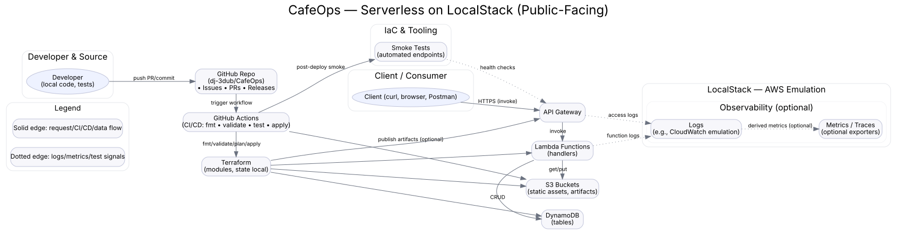
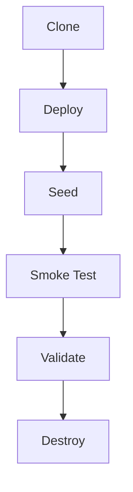

# CafeOps

> **Production-Inspired Serverless AWS Platform**

**Design. Deploy. Validate. Automate.**

[](https://github.com/dj-3dub/CafeOps/actions/workflows/validate.yml)
[](LICENSE)
[](https://github.com/dj-3dub/CafeOps/commits/main)
[](https://github.com/dj-3dub/CafeOps)

**Terraform • AWS Lambda • API Gateway • DynamoDB • Python • LocalStack
• Docker**



## Table of Contents

-   Overview
-   Why I Built This
-   Engineering Philosophy
-   Design Philosophy
-   Engineering Principles
-   Objectives
-   Key Highlights
-   Technology Stack
-   Architecture
-   Repository Structure
-   Prerequisites
-   Quick Start
-   Makefile Interface
-   Development Workflow
-   Validation
-   AWS Architecture
-   AWS Services
-   AWS Competencies Demonstrated
-   Testing
-   Screenshots
-   Documentation
-   Roadmap
-   Lessons Learned
-   Portfolio Engineering Standard
-   License
-   Author

## Project Status

  Component                         Status
  ------------------------------ ------------
  🏗 Infrastructure                    ✅
  ☁ AWS Services                      ✅
  🤖 Automation                       ✅
  🧪 Validation                       🚧
  📚 Documentation                    🚧
  🚀 Production AWS Deployment    📅 Planned

# Overview

CafeOps is a production-inspired serverless application that models
inventory, order processing, and stock management for a fictional coffee
shop.

Built with Terraform, AWS Lambda, API Gateway, DynamoDB, Python, and
LocalStack, CafeOps demonstrates Infrastructure as Code, serverless
application architecture, operational automation, validation, and modern
cloud engineering practices through a fully reproducible local AWS
environment.

# Why I Built This

CafeOps was developed as part of my AWS Certified Solutions Architect --
Associate (SAA-C03) preparation. Rather than building isolated examples,
I wanted to create a complete serverless platform that reflects
production-inspired engineering practices.

# Engineering Philosophy

Every flagship project in my portfolio follows the same methodology:

-   Architecture First
-   Infrastructure as Code
-   Automation by Default
-   Validation Before Deployment
-   Documentation as Code
-   Repeatable Workflows
-   Operational Simplicity

# Design Philosophy

CafeOps is intentionally organized like a small production service
instead of a tutorial. Every architectural decision favors
maintainability, repeatability, and operational clarity.

# Objectives

-   Provision infrastructure with Terraform
-   Build REST APIs using API Gateway and Lambda
-   Store data in DynamoDB
-   Develop against LocalStack
-   Automate deployment and validation
-   Demonstrate AWS SAA concepts

# Key Highlights

-   Production-inspired architecture
-   Infrastructure as Code
-   LocalStack-powered development
-   Automated validation
-   GitHub Actions CI
-   Architecture-first documentation

# Technology Stack

  Category            Technology
  ------------------- ----------------
  Cloud               AWS
  IaC                 Terraform
  Compute             Lambda
  API                 API Gateway
  Database            DynamoDB
  Language            Python
  Local Development   LocalStack
  Containers          Docker
  Automation          GNU Make
  CI                  GitHub Actions

# Architecture

See `docs/architecture/cafeops.svg` for the complete architecture.

## Request Flow

``` text
Client
  ↓
API Gateway
  ↓
Lambda
  ↓
DynamoDB
  ↓
JSON Response
```

# Repository Structure

``` text
CafeOps/
├── docs/
├── infra/
├── scripts/
├── src/
├── tests/
├── webui/
├── Makefile
└── README.md
```

# Prerequisites

-   Docker
-   Terraform
-   Python 3
-   GNU Make
-   Git

# Quick Start

``` bash
make up
make init
make apply
make seed
make smoke
make validate
```

# Makefile Interface

-   Lifecycle
-   Infrastructure
-   Application
-   Validation
-   Documentation
-   Cleanup

# Development Workflow


``` mermaid
flowchart TD
A[Clone]-->B[Deploy]
B-->C[Seed]
C-->D[Smoke Test]
D-->E[Validate]
E-->F[Destroy]
```

# Validation

``` text
✓ Docker
✓ LocalStack
✓ Terraform
✓ Lambda
✓ API Gateway
✓ DynamoDB
✓ Smoke Tests

PASSED: 28
WARNINGS: 0
FAILED: 0
```

# AWS Architecture

CafeOps demonstrates a modern serverless architecture built around
managed AWS services and Infrastructure as Code.

# AWS Services

  Service       Purpose            Status
  ------------- ----------------- --------
  API Gateway   REST API             ✅
  Lambda        Compute              ✅
  DynamoDB      Persistence          ✅
  IAM           Least Privilege      ✅
  CloudWatch    Monitoring           🚧
  SNS           Notifications        📅

# AWS Competencies Demonstrated

  SAA Domain                Demonstrated Through
  ------------------------- -------------------------------------
  Secure Architectures      IAM
  Resilient Architectures   Stateless Lambda + DynamoDB
  High Performance          API Gateway + Lambda
  Cost Optimization         Serverless
  Operational Excellence    Terraform + Automation + Validation

# Testing

Infrastructure checks, API verification, Lambda execution, DynamoDB
connectivity, smoke tests, and validation are included.

# Screenshots

-   Architecture
-   Web UI
-   LocalStack
-   Terraform
-   Validation
-   GitHub Actions

# Documentation

-   Architecture Overview
-   Terraform Guide
-   Operational Runbook
-   Architecture Decision Records
-   Graphviz Diagrams

# Roadmap

## Phase 1

-   ✅ Core Platform
-   ✅ Validation
-   ✅ Web UI

## Phase 2

-   [ ] CloudWatch
-   [ ] SNS
-   [ ] EventBridge
-   [ ] Cognito

## Phase 3

-   [ ] SQS
-   [ ] Step Functions
-   [ ] S3
-   [ ] Production AWS Deployment

# Lessons Learned

Building CafeOps reinforced that successful cloud engineering is less
about deploying individual AWS services and more about designing systems
that are repeatable, maintainable, observable, and well documented.

# Portfolio Engineering Standard

Every flagship project in my portfolio includes:

-   Architecture documentation
-   Infrastructure as Code
-   Automation
-   Validation
-   Operational runbooks
-   Repeatable deployment workflows

# License

MIT License.

# Author

**Timothy Heverin**

Infrastructure Engineer • Cloud Engineer • AWS Solutions Architect
Associate Candidate

AWS • Terraform • Linux • Python • Docker • Infrastructure as Code •
Automation

------------------------------------------------------------------------

**Design. Deploy. Validate. Automate.**
