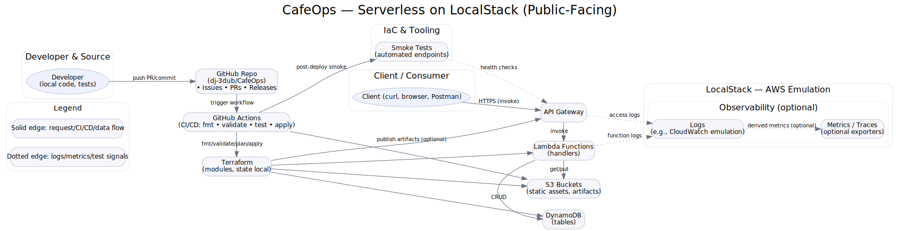

<p align="center">
  
</p>

# ☕ CafeOps — Serverless Inventory for a Coffee Shop

**CafeOps** is a fully **serverless inventory management system** built for a fictional coffee shop.  
It runs entirely on **AWS-emulated services via LocalStack**, using **Lambda, API Gateway, and DynamoDB**, all orchestrated with **Terraform** and wrapped in a clean developer experience with `make` and Python helper scripts.

---

## 🚀 Overview

CafeOps demonstrates how to design and automate a **modern cloud-native backend** without provisioning or maintaining servers.  
It provides an inventory API for managing menu items, stock movements, and orders — locally emulated yet architected for production.

### 🧩 Core Architecture

| Layer | Service / Tech | Description |
|-------|----------------|-------------|
| **Compute** | AWS Lambda (Python 3.11) | Stateless functions for item, stock, and order APIs |
| **API Layer** | Amazon API Gateway v2 | Routes REST endpoints (`/items`, `/orders`, `/stock`) |
| **Data Layer** | DynamoDB | Serverless key-value data store for items, orders, and stock events |
| **IaC** | Terraform | Defines all infrastructure with repeatable IaC |
| **Local Emulation** | LocalStack | Spins up AWS-like endpoints for development and testing |
| **Automation** | Makefile + Bash + Python | Streamlined workflows (`make up`, `make apply`, `make smoke`) |

---

## 🧠 What I Learned

- **Serverless application design:** separating stateless business logic (Lambda) from persistent data (DynamoDB).  
- **API Gateway integration:** exposing Lambdas via RESTful endpoints and managing routing.  
- **Infrastructure as Code (IaC):** using Terraform modules and outputs to fully automate environment setup.  
- **LocalStack simulation:** building and debugging AWS-style architectures locally without cloud costs.  
- **Observability & testing:** using custom smoke tests and diagnostic scripts to validate APIs and Lambda execution.  
- **Resilience & error handling:** implementing conditional updates, type validation, and decimal handling in DynamoDB.  
- **Modern DevOps patterns:** using Makefiles for reproducible developer workflows and Python scripting for automation.

---

## ☕ CafeOps Architecture

<p align="center">
  
</p>

Public-facing overview of **CafeOps** — an AWS serverless stack emulated with **LocalStack**, provisioned by **Terraform**, and validated via **GitHub Actions** and **smoke tests**.

---

## ⚙️ Local Development

### 1️⃣ Start LocalStack
```bash
make up
```

### 2️⃣ Provision Infrastructure
```bash
make init
make apply
```

### 3️⃣ Run Smoke Tests
```bash
./scripts/smoke.sh
```

### 4️⃣ Launch Web UI (if enabled)
```bash
python3 -m http.server 8082
```
Then open: [http://localhost:8082](http://localhost:8082)

---

## 🧪 Example API Calls

```bash
# Create an item
curl -X POST "$API/items" -d '{"sku":"ESP-001","name":"Espresso","price":3.50,"stock":10}' -H "Content-Type: application/json"

# Get all items
curl "$API/items"

# Record stock in/out
curl -X POST "$API/stock/in"  -d '{"sku":"ESP-001","qty":5,"reason":"delivery"}' -H "Content-Type: application/json"
curl -X POST "$API/stock/out" -d '{"sku":"ESP-001","qty":2,"reason":"sale"}' -H "Content-Type: application/json"
```

---

## 🧰 Project Structure

```
CafeOps/
├── infra/
│   └── terraform/        # Terraform modules & state
├── lambdas/
│   └── handlers/         # Python Lambda handlers
├── scripts/              # Smoke tests, diagnostics, helpers
├── Makefile              # Workflow automation
└── README.md             # You're here
```

---

## 🪜 Elevator Pitch

> **CafeOps** is a self-contained serverless system that emulates a real-world AWS production backend —  
> complete with IaC provisioning, Lambda functions, and API integration — all running locally.  
> It shows how to design scalable cloud systems without a single VM, proving that infrastructure, automation,  
> and developer experience can coexist cleanly in one reproducible stack.

---

## 🏁 Next Steps

- Add CloudWatch logging and metrics exporters via LocalStack extensions.  
- Expand the Web UI with dynamic item creation and order dashboards.  
- Deploy to AWS using Terraform backends and real AWS credentials.

---

<p align="center">
  <sub>☕ Built with passion for code, coffee, and clean architecture.</sub>
</p>
